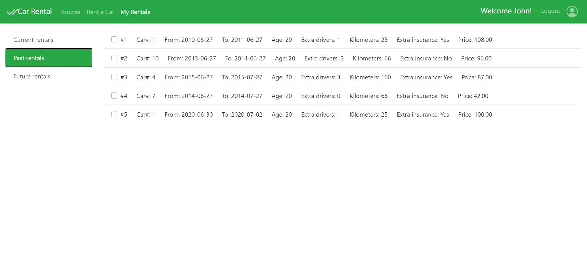
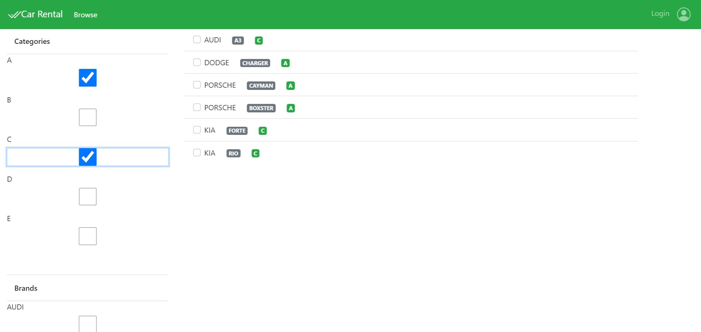
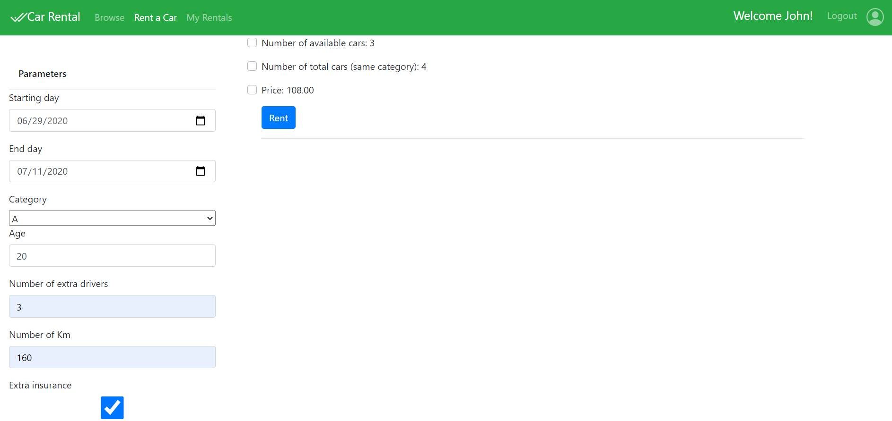
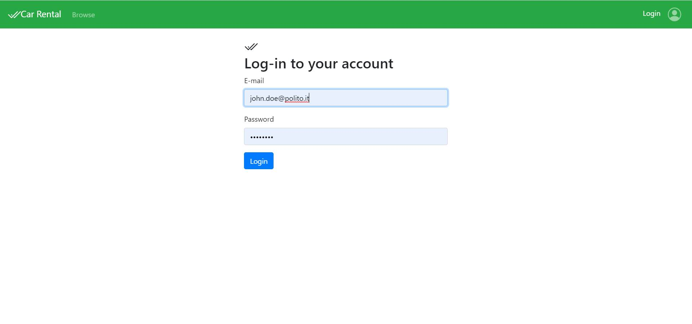

# Car Rental

## Introduction

This is a web application project for managing a car rental company.

The company owns a set of vehicles. Vehicles are divided into 5 categories (A…E), according to their size.

Each car is also characterized by a brand (e.g., Audi, Ford, Fiat, Mercedes, …) and a model (i.e., a string).

Unauthenticated users may browse a list containing the full set of vehicles, and the list may be filtered
by category and/or brand (the user may simultaneously select one or more categories and one or more
brands). The list of vehicles updates in real time as soon as the filters are modified.

Once authenticated, users have access to an interactive configuration page, that replaces the original
browsing page. In the configurator, they can set the parameters for their new rental. Rental parameters
are: starting day, end day, car category, driver’s age, number of extra drivers, estimated number of
kilometers per day, extra insurance (yes/no).

For each combination, if all parameters are correctly specified, the page should interactively show the
number of available cars (matching all criteria), and the rental price for that solution. The number of
available cars must count how many cars in the right category are available in all the days of the rental.

The rental price is computed by considering different factors, that are also
affected by the number of available vehicles (when fewer vehicles would remain, the price grows
higher). Also, after 3 successful finished rentals, the customer gains a 10% discount over all his/her new
rentals.

If the user accepts the proposal in the interactive configurator (the specific car is selected by the system), he/she must pay immediately, as soon as he/she confirms the
reservation.

Authenticated users, in addition, in a dedicated page may check the list of their future reservations (and
possibly cancel them) and check the history of their current or past rentals.

## Installation Instructions
to clone the repository and install all required modules
``` 
git clone git@github.com:tonyYSaliba/car-rental.git
cd car-rental

```

To run the server on Node.Js
```
cd server
nodemon server.js

```

To run the React application
```
cd client
npm start

```

## React client application routes

- Route `/login`: Contains fields to enter logIn information, in order to login into a certain account
- Route `/browse`: Page that allows users to browse a list containing the full set of vehicles, and the list may be filtered by category and/or brand
- Route `/configurator`: Page to make a new rental. Contains fields in order to enter parameters for rentals
- Route `/rentals`: Contains a list of all rentals for a certain user. rentals are filtered by "current rentals", "future rentals" and "past rentals"
- Route `/rentals/:filter`: Same as `/rentals`, and the parameters could be "past" (to get past rentals), "future" (to get future rentals) and null (to get current rentals by default)
- Route `/add/:price`: Page showing price of the rental and fields to fill credit card information in order to make the payment for the rental. parameter "price", is an int, and it's the price of the rental.
- Route `/init`: It's not a page, it's just used to wait for a certain state update, and then redirect to `/browse` after the update. It is used on startup, it initializes the web application.

## REST API server

- POST `/api/login`
  - username, password
  - cookie, user.id, user.name
- POST `/api/cars/browse`
  - {idZ, categories, brands}
  - Array of cars
- POST `/api/cars/availableCars`
  - rental parameters
  - Array of cars
- POST `/api/rental`
  - rental parameters
  - rental id
- POST `/api/payment`
  - cardNumber, cardCode
  - status(204)
- GET `/api/cars/availableCars/pricing`
  - none
  - pricing array
- GET `/api/cars/availableCars/brands`
  - none
  - array of all brands in the cars database
- GET `/api/user`
  - user
  - user.id, user.name
- GET `/api/rentals/futureRentals`
  - user
  - array of rentals
- GET `/api/rentals/pastRentals`
  - user
  - array of rentals
- GET `/api/rentals/currentRentals`
  - user
  - array of rentals
- DELETE `/api/rentals/futureRentals/:rentalId`
  - rental id
  - status(204)


## Server database

- Table `users` - contains id name email hash
- Table `cars` - contains id category brand model
- Table `pricing` - contains id item price
- Table `rentals` - contains id user_id car_id age starting_day end_day number_extra_drivers number_kilometers extra_insurance price

## Main React Components

- `Header` (in `Header.js`): Header of the page
- `Item` (in `Item.js`): Item specifications. Item  could be a rental contract or a car
- `LoginForm` (in `LoginForm.js`): LogIn component
- `List` (in `List.js`): It is a container for the elements
- `RentalForm` (in `RentalForm.js`): Used for filling the credit card information
- `Filters` (in `Filters.js`): contains different kind of parameters. Filters could be rental parameters, browse parameters or configurator parameters

## Screenshot










## Test users

* tony.saliba@polito.it, tony
* yara.saliba@polito.it, yara
* john.doe@polito.it, password (frequent customer)
* silar.saliba@polito.it, silar
* david.moukasher@polito.it, david (frequent customer)
